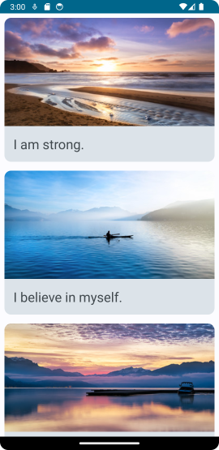
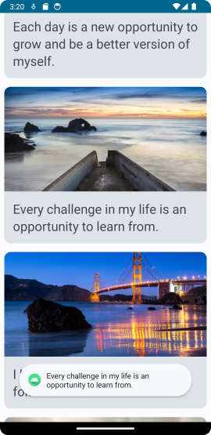
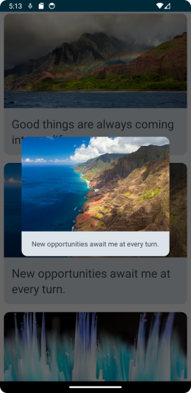
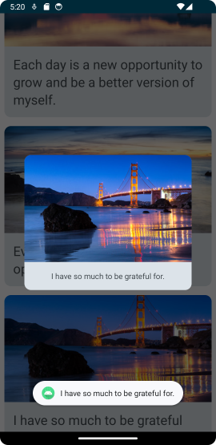

# Affirmations

URL of codelabs example:

https://developer.android.com/codelabs/basic-android-kotlin-compose-training-add-scrollable-list#0

---

## IMPORTANT PLEASE READ AND MAKE NOTE

1. Remember the parent folder is the one under version control - please **do not** initialise a repository in the local folder.
2. When working on this branch please checkout branch 'main-affirmation', 

**git checkout main-affirmation**

3. Make sure to commit regularly - ideally mapping to tasks as you go through the exercise.
4. The starting project of this project matches the 'starter' branch of the Google codelabs (i.e it is all set to go)
5. The project was created with Android Hedgehog, Gradle 8.2

---
***Folder Explanation***

REQUIRED WORK

Please make sure that you have a commit point that matches the end of the exercise and will produce the following 
screenshot when complete. (This is the Light Theme render of the final application)

EXTENSION

To extend the exercise, make the list item **clickable**. Clicking the ListView should open a Toast and a Dialog view 
from the selected affirmation. The expected behaviour is in the final screenshot. The previous 2 show each individual 
additional view element.

|            **Click - Toast Message**             |                **Click - Dialog**                 |                **Click - Toast + Dialog**                 |
|:------------------------------------------------:|:-------------------------------------------------:|:---------------------------------------------------------:|
|  |  |  |

---
### Please use the Discussion Forum on the VLE for questions. ###

