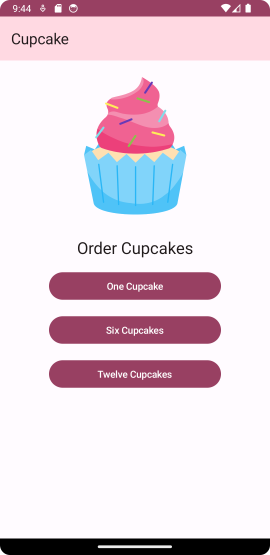
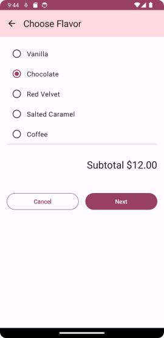
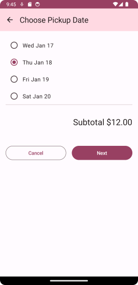
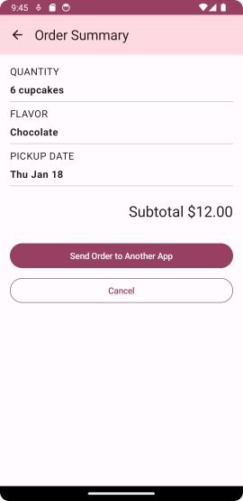
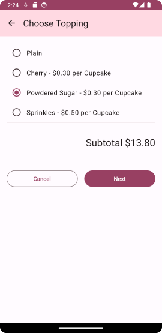
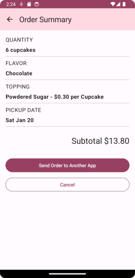

# Cupcake

URL of codelabs example:

https://developer.android.com/codelabs/basic-android-kotlin-compose-navigation#0

---

## IMPORTANT PLEASE READ AND MAKE NOTE

1. Remember the parent folder is the one under version control - please **do not** initialise a repository in the local folder.
2. When working on this branch please checkout branch 'main-cupcake', 

**git checkout main-cupcake**

3. Make sure to commit regularly - ideally mapping to tasks as you go through the exercise.
4. The starting project of this project matches the 'starter' branch of the Google codelabs (i.e it is all set to go)
5. The project was created with Android Hedgehog, Gradle 8.2

---
***Folder Explanation***

REQUIRED WORK

Please make sure that you have a commit point that matches the end of the exercise and will produce the following 
navigational sequence as shown in the screenshot. 

|                  **Screen 1**                  |                  **Screen 2**                  |            **Screen 3**      |                  **Screen 4**                  |
|:----------------------------------------------:|:----------------------------------------------:|:----------------------------------:|:----------------------------------------:|
|  |  |  |  |

EXTENSION

To extend the exercise, insert an extra page (Route/View). This should be a CHOOSE TOPPING Page and will appear after the
CHOOSE FLAVOR. The sequence should then continue. A topping should have a price applicable per cupcake which is reflected 
in the calculated price.

|                  **Screen 1**                  |                  **Screen 2**                  |                    **Screen 3**                    |                    **Screen 4**                     |                    **Screen 5**                     |
|:----------------------------------------------:|:----------------------------------------------:|:--------------------------------------------------:|:---------------------------------------------------:|:---------------------------------------------------:|
|  |  |  |  |  |

---
### Please use the Discussion Forum on the VLE for questions. ###

