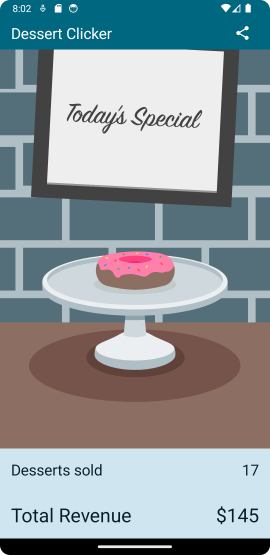
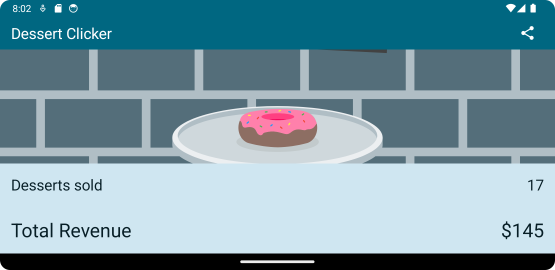

# Dessert Clicker

URL of codelabs example:

https://developer.android.com/codelabs/basic-android-kotlin-compose-activity-lifecycle#0

---

## IMPORTANT PLEASE READ AND MAKE NOTE

1. Remember the parent folder is the one under version control - please **do not** initialise a repository in the local folder.
2. When working on this branch please checkout branch 'main-desserts', 

**git checkout main-desserts**

3. Make sure to commit regularly - ideally mapping to tasks as you go through the exercise.
4. The starting project of this project matches the 'starter' branch of the Google codelabs (i.e it is all set to go)
5. The project was created with Android Hedgehog, Gradle 8.2

---
***Folder Explanation***

REQUIRED WORK

Please make sure that you have a commit point that matches the end of the exercise and will produce the following 
screenshot when complete. (This is the Light Theme render of the final application)

|                   **Portrait**                   |                    **Landscape**                    |
|:------------------------------------------------:|:---------------------------------------------------:|
|  |  |

EXTENSION

The extension for this exercise is to complete:

https://developer.android.com/codelabs/basic-android-kotlin-compose-practice-viewmodel#0

This changes the prior example from using **rememberSaveable** to a **ViewModel Class**.
Please make commits at appropriate steps. The final views will be the same, as it is just the way that the model is 
being accessed is changed.

|                   **Portrait**                   |                    **Landscape**                    |
|:------------------------------------------------:|:---------------------------------------------------:|
|  |  |

---
### Please use the Discussion Forum on the VLE for questions. ###

