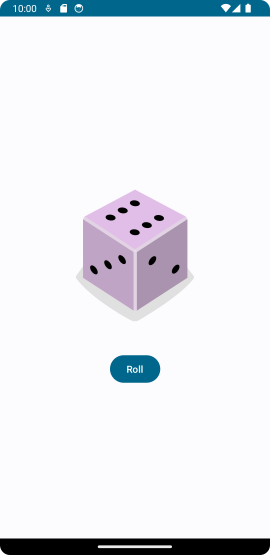
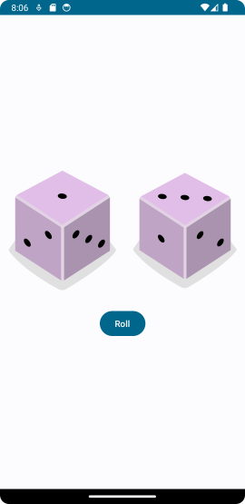
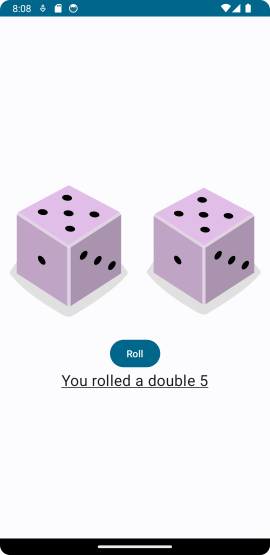

# DiceRoller

URL of codelabs example:

https://developer.android.com/codelabs/basic-android-kotlin-compose-build-a-dice-roller-app#0

---

## IMPORTANT PLEASE READ AND MAKE NOTE

1. Remember the parent folder is the one under version control - please **do not** initialise a repository in the local folder.
2. When working on this branch please checkout branch 'main-diceroller', 

**git checkout main-diceroller**

3. Make sure to commit regularly - ideally mapping to tasks as you go through the exercise.
4. The starting project of this project matches the 'starter' branch of the Google codelabs (i.e it is all set to go)
5. The project was created with Android Hedgehog, Gradle 8.2

---
***Folder Explanation***

REQUIRED WORK

Please make sure that you have a commit point that matches the end of the exercise and will produce the following 
screenshot when complete - the roll button when clicked will change the number on the dice. 

EXTENSION

To extend the exercise, add a second dice to the screen. The roll button will roll both dice. If a double is rolled, a
message appears. Orientating the device retains the current state of the dice. Please make sure that you have a 
commit point that matches the end of the exercise, and will produce the following behaviour.

|                     **No double rolled**                     |                    **A double rolled**                    |
|:------------------------------------------------------------:|:---------------------------------------------------------:|
|  |  |

---
### Please use the Discussion Forum on the VLE for questions. ###

