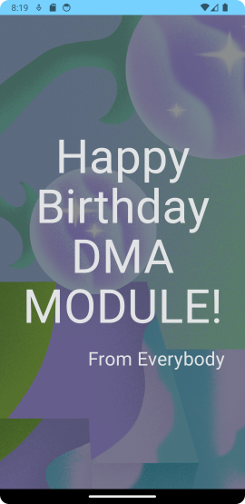

# Birthday Greeting Card

URL of codelabs example:

Please note that this consists of 2 short exercise

https://developer.android.com/codelabs/basic-android-kotlin-compose-text-composables#0

https://developer.android.com/codelabs/basic-android-kotlin-compose-add-images#0

---

## IMPORTANT PLEASE READ AND MAKE NOTE

1. Remember the parent folder is the one under version control - please **do not** initialise a repository in the local folder.
2. When working on this branch please checkout branch 'main-birthday', 

**git checkout main-birthday**

3. Make sure to commit regularly - ideally mapping to tasks as you go through the exercise.
4. The start point of the project is Step 3 - What is Jetpack Compose, as the project has been created.
5. The project was created with Android Hedgehog, Gradle 8.2

---
***Folder Explanation***

REQUIRED WORK

Please make sure that you have a commit point that matches the end of the exercise and will produce the following 
screenshot. (The words can be changed)

EXTENSION

To extend the exercise, modify the greeting to reflect a Christmas Theme with appropriate message. Make sure there 
is a commit point. 

---
### Please use the Discussion Forum on the VLE for questions. ###

