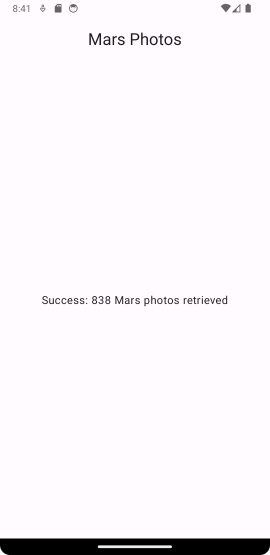
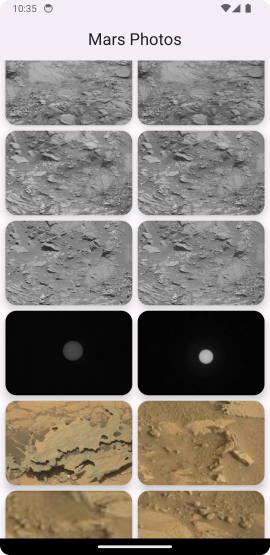
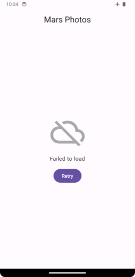

# Mars Photo (Working with the Internet)

URL of codelabs example:

https://developer.android.com/codelabs/basic-android-kotlin-compose-getting-data-internet#0

---

## IMPORTANT PLEASE READ AND MAKE NOTE

1. Remember the parent folder is the one under version control - please **do not** initialise a repository in the local folder.
2. When working on this branch please checkout branch 'main-mars', 

**git checkout main-mars**

3. Make sure to commit regularly - ideally mapping to tasks as you go through the exercise.
4. The start point of the project is Step 3 - What is Jetpack Compose, as the project has been created.
5. The project was created with Android Hedgehog, Gradle 8.2

---
***Folder Explanation***

REQUIRED WORK

Please make sure that you have a commit point that matches the end of the exercise and will produce the following 
screenshot.

EXTENSION

The extension to this exercise requires the images to be downloaded. The steps to do this are included in additional 
codelabs exercise. 

https://developer.android.com/codelabs/basic-android-kotlin-compose-load-images#0

Make sure to carry on from the last commit point. There are some additional changes you need to make
to your exercise to bring it to the start point. Please refer to the above exercise and its link to a github repository 
for starter changes. Make these a new commit before starting the extension in full. The files that need updating are:

build.gradle (new dependencies)

AppContainer.kt (new file)

MarsPhotoRepository.kt (new file)

MarsPhoto.kt (moved location)

MarsApiService.kt (changed)

MarsPhotoApplication.kt (new file)

AndroidManifest.xml (changed)

|            **Images as Grid Layout**             |         **Revised Retry Page**          |
|:------------------------------------------------:|:---------------------------------------:|
|  |  |

---
### Please use the Discussion Forum on the VLE for questions. ###

