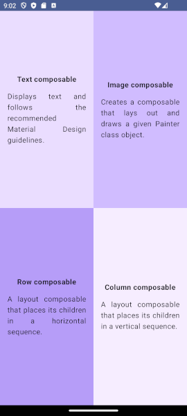

# Quadrants

URL of codelabs example:

Please note that this lab is not a step-by-step but provides a definition of what the end screen 
should look like. A view that is **reused** 4 times, with each view covering a quadrant on the 
screen.

https://developer.android.com/codelabs/basic-android-kotlin-compose-composables-practice-problems#3

---

## IMPORTANT PLEASE READ AND MAKE NOTE

1. Remember the parent folder is the one under version control - please **do not** initialise a repository in the local folder.
2. When working on this branch please checkout branch 'main-quadrants', 

**git checkout main-quadrants**

3. Make sure to commit regularly - ideally mapping to tasks as you go through the exercise.
4. The starting project has all the STRINGS already added to strings.xml (res folder)
5. Colours have been added to colors.xml, although you may opt to pass the Color as a Color value directly to the View when building.
6. The project was created with Android Hedgehog, Gradle 8.2

---
***Folder Explanation***

REQUIRED WORK

Please make sure that you have a commit point that matches the end of the exercise and will produce the following 
screenshot. 

EXTENSION

To extend the exercise, modify the view object such that it contains an image of a country flag, 
with the text reflecting the name of that country. (You are free to choose countries)

---
### Please use the Discussion Forum on the VLE for questions. ###

