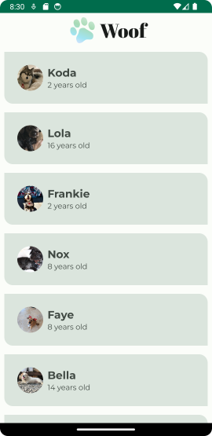
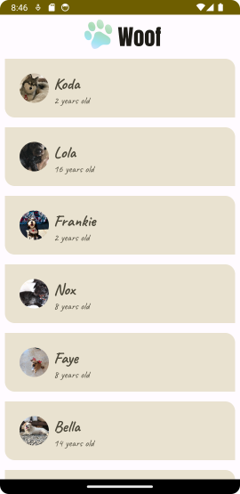
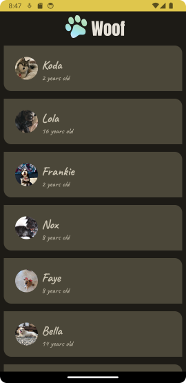

# Woof

URL of codelabs example:

https://developer.android.com/codelabs/basic-android-kotlin-compose-material-theming#0

---

## IMPORTANT PLEASE READ AND MAKE NOTE

1. Remember the parent folder is the one under version control - please **do not** initialise a repository in the local folder.
2. When working on this branch please checkout branch 'main-woof', 

**git checkout main-woof**

3. Make sure to commit regularly - ideally mapping to tasks as you go through the exercise.
4. The starting project of this project matches the 'starter' branch of the Google codelabs (i.e it is all set to go)
5. The project was created with Android Hedgehog, Gradle 8.2

---
***Folder Explanation***

REQUIRED WORK

Please make sure that you have a commit point that matches the end of the exercise and will produce the following 
screenshot when complete. (This is the Light Theme render of the final application)

EXTENSION

To extend the exercise, add a new colour theme for both **LIGHT** and **DARK**. New fonts should also be added for the 
TopBar and ListItems. Make sure there is a commit point that matches the screens. (Colours and Fonts are free to choose)

|               **Light Theme**                |               **Dark Theme**               |
|:--------------------------------------------:|:------------------------------------------:|
|  |  |

---
### Please use the Discussion Forum on the VLE for questions. ###

